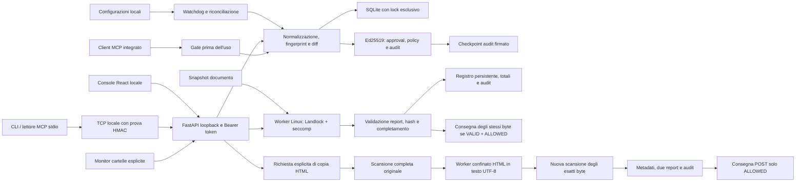

# Architettura e modello delle minacce

Linux è la piattaforma principale. Il confinamento documentale richiede un kernel con Landlock ABI almeno 3 e libseccomp; in sua assenza il worker nega l’analisi. App e sviluppo restano separati in `D:\Cheker\app` e `D:\Cheker\dev`, accessibili in WSL come `/mnt/d/Cheker/app` e `/mnt/d/Cheker/dev`. Requisiti di installazione e architetture effettivamente provate sono distinti nel [registro di validazione](VALIDAZIONE.md).

## Beni e confini

I beni protetti sono l’identità della versione approvata, la configurazione di connessione, le evidenze di audit e i contenuti da consegnare al modello. Fonti esterne, nomi dei tool, descrizioni, file e valori MCP sono dati non fidati. Il codice degli adapter, il pacchetto applicativo, l’account locale, la chiave e il checkpoint sono parte della base fidata.

| Minaccia | Controllo implementato | Limite |
|---|---|---|
| 0042 mutazione dopo approvazione | RAW/canonical/fingerprint, versioni, rilettura al gate | Il client deve usare la definizione verificata |
| 0052 config write | Monitor e diff dei campi, invalidazione dei componenti figli | Non impedisce la scrittura OS, nega l’uso tramite gate |
| Riutilizzo nome/ID | Identità + versione + hash firmati | Non attesta comportamento dell’eseguibile |
| Ripristino di una vecchia definizione | Nuova versione per ogni modifica osservata | Modifiche transitorie non osservate fra due letture non sono ricostruibili |
| Approval o database manipolati | Verifica firma, hash snapshot e lifecycle firmato | Amministratore con chiave fuori dal modello |
| Audit modificato/troncato | Hash chain, firme evento e checkpoint separato | Rollback completo richiede checkpoint esterno fidato |
| Prompt injection in file/tool description | Regole multilingua, normalizzazione, hidden/encoding | Euristica, non dimostrazione di innocuità |
| Parser bomb/decoder bomb | Dimensione, profondità, conteggi, timeout e memoria worker | Le configurazioni usano parser in processo con limiti strutturali |
| Compromissione del parser documentale | Processo isolato prima dell'input, Landlock, seccomp, ambiente minimo e limiti I/O | Kernel, runtime e pacchetti installati fanno parte della base fidata |
| Listener locale contraffatto | Prova HMAC con nonce, indirizzo e porta reali; richiesta sulla stessa connessione | Non equivale a TLS o protezione da amministratori e forwarding fra namespace |
| Cross-origin e DNS rebinding | Loopback, Host consentiti, Origin e token | Altri processi dello stesso account possono leggere il token |
| Doppio writer app/CLI | Lock esclusivo OS e CLI che usa l’API dell’app | Un solo processo può possedere lo store |
| TOCTOU documento | Lettura stabile con fstat/stat, scan dello snapshot e consegna degli stessi byte | Non è un lock distribuito sul filesystem |

## Persistenza e ripristino

`integrity.sqlite3` contiene componenti, snapshot, versioni, approval, eventi e policy. `scans.sqlite3` contiene report e metadati delle copie testuali, senza conservarne il corpo. `approval-key.pem` firma le evidenze; `audit-head.json` lega l’ultimo numero di sequenza al suo hash. `api-token` abilita l’amministrazione locale.

Le operazioni ordinarie possono riusare un prefisso dell'audit già verificato. La cache è vincolata alla connessione SQLite, al database e WAL, al contenuto del checkpoint e allo schema effettivo; modifiche o evidenze ambigue richiedono una nuova verifica integrale. L'append avanza la cache solo dopo commit e checkpoint riusciti. La verifica esplicita dell'audit ricalcola sempre l'intera catena. Benchmark e regressioni sono riportati in `PERFORMANCE.md` e `VALIDAZIONE.md`.

Le letture dell'inventario verificano identità, contenuto, fingerprint e versione degli snapshot contro la cronologia firmata, condividendo la raccolta degli eventi tra le righe. Una copia non verificabile viene proiettata come `BLOCKED`, con `snapshot_valid=false`, contenuto nascosto e approvazione corrente non esposta; il record originale rimane intatto. La proiezione controlla anche i tipi dei campi mostrati e la stabilità delle evidenze durante la lettura. Non rilegge le sorgenti né esegue il gate durante il polling: `snapshot_valid=true` descrive la copia registrata e non autorizza da solo l'uso corrente, che richiede ancora firma, policy, ciclo di vita e sorgente validi.

Eseguire backup della cartella dati con il servizio fermo. Copiare anche chiave e checkpoint in una destinazione con accessi controllati; esportare periodicamente audit e checkpoint fuori dall’host per un riferimento indipendente. Non eliminare automaticamente un checkpoint non valido e non rigenerare la chiave su un archivio esistente. In caso di divergenza, preservare tutti i file per analisi e ripristinare un backup completo verificato. Un nuovo archivio richiede nuove approvazioni.

## API

La mappa dei payload è in [CONTRACT.md](../CONTRACT.md); le implementazioni sono `backend/integrity_guard/api.py`. Input con campi inattesi vengono rifiutati. UI e API sono servite dalla stessa origine; non vengono caricati font, script, CDN o telemetry esterni. I file upload vengono letti come dati e i report non includono il documento completo. Le rotte della copia testuale, comprese le differenze fra risposta POST e metadati GET, sono documentate in [SANITIZZAZIONE.md](SANITIZZAZIONE.md).

## Documenti e copie testuali

L’estrazione ordinaria produce segmenti visibili, nascosti e di metadati per le regole comuni dello scanner. Il frontmatter Markdown iniziale YAML (`---`) o TOML (`+++`) viene aggiunto come testo grezzo al livello `METADATA`; l’intero sorgente resta anche nel livello visibile. Il blocco non viene deserializzato come configurazione e non può selezionare plugin. Un blocco chiuso oltre 64 KiB o 4096 righe interrompe l’analisi; un delimitatore iniziale senza chiusura resta Markdown ordinario sotto i limiti generali.

La copia testuale HTML segue un percorso esplicito distinto: scansione completa dell’originale, trasformazione in un worker confinato e nuova scansione degli esatti byte UTF-8 prodotti. Le due scansioni e la trasformazione condividono il limite di due worker, rilasciando lo slot fra gli stadi. `transformation_status=SANITIZED` descrive la trasformazione riuscita; è possibile avere contemporaneamente `delivery_status=DENIED`. Solo una copia completa con verdetto `VALID`, stato `ALLOWED`, nessun finding, policy corrente e registrazione riuscita viene consegnata.

Solo la risposta POST corrente può contenere il payload Base64 autorizzato. Il browser lo decodifica in bytes, verifica dimensione e SHA-256 contro i metadati e crea il file senza ricodifica del testo; digest assente o diverso impedisce il download. I GET dello storico restituiscono solo metadati e riferimenti ai report, senza autorizzazione riutilizzabile né corpo della copia. Entrambe le scansioni completate contribuiscono ai normali contatori; l’operazione di trasformazione non è una scansione aggiuntiva.

Il profilo `html-text-v1` perde markup, metadati e sottostrutture escluse, con output massimo di 256 KiB. Non dimostra equivalenza semantica o sicurezza universale, non riscrive le istruzioni sospette ancora visibili e non converte altri formati. Il file originale rimane intatto. Nessun lettore o gate acquisisce un’eccezione di autorizzazione grazie a `SANITIZED`. [SANITIZZAZIONE.md](SANITIZZAZIONE.md) descrive profilo, rifiuti e limiti.

## Estensioni

Il registro degli estrattori aggiuntivi viene costruito da un bootstrap incluso nel wheel e congelato prima della lettura del documento nel worker. I risultati attraversano controlli comuni di tipo, completamento e budget; le normali regole dello scanner analizzano anche i segmenti prodotti dagli estrattori registrati. Il contesto del monitor comprende il fingerprint del registro, del codice confezionato e delle dipendenze dichiarate. Nella precedente wheel `039e0fd8…` il registro aggiuntivo era vuoto. La wheel qualificata `f426c5aa…` registra esplicitamente il solo profilo XLSX statico. L’handler `xlsx_extractor.extract_xlsx` usa la dipendenza già presente `defusedxml` e gli stessi worker/report; non esegue Office, formule o OCR. Celle e metadati Transitional sono analizzati entro limiti; macro, media, dati esterni diversi dagli hyperlink e strutture non ispezionate interrompono la scansione. Il modulo rientra nel fingerprint del pacchetto; la qualifica della wheel e dell’installazione è documentata in [VALIDAZIONE.md](VALIDAZIONE.md). [ESTRATTORI.md](ESTRATTORI.md) descrive il contratto per lo sviluppo.

Gli adapter e gli estrattori sono codice di fiducia installato dall’operatore, non plugin caricati da un documento. Una futura integrazione proxy dovrà fissare la versione MCP, gestire inizializzazione, paginazione delle liste, cambiamenti notificati, autorizzazione per sessione, cancellazione e streaming, verificando i contenuti effettivamente inoltrati. Non chiamare gate su una copia e inoltrare una definizione diversa.
