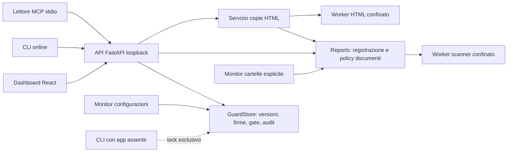

# Manuale tecnico e operativo

Questo manuale descrive MCP Integrity Guard 1.0.0 per amministratori Linux e manutentori. Le interfacce e i limiti sono quelli implementati nel repository; i risultati di collaudo delle singole build sono in [VALIDAZIONE.md](VALIDAZIONE.md). Per modificare o rilasciare il software leggere anche [SVILUPPO.md](SVILUPPO.md).

## 1. Scopo e confini

Il programma registra definizioni MCP, rileva variazioni, raccoglie approvazioni firmate e decide se una precisa versione può essere usata. Analizza inoltre documenti in processi Linux confinati e offre letture vincolate ai byte analizzati. Non avvia i comandi trovati nelle configurazioni e non contatta i relativi endpoint.

Il controllo diventa operativo quando il chiamante usa il gate, la CLI `guarded-read` o il lettore MCP fornito. Un monitor di filesystem non impedisce a un altro programma di leggere direttamente un file o di ignorare una decisione. Non sono implementati un proxy MCP trasparente, l’attestazione degli eseguibili/container referenziati, un antivirus generale o la verifica universale dell’assenza di prompt injection.

Il servizio amministrativo, il sistema operativo, l’interprete, le dipendenze e il codice installato appartengono alla base di fiducia. Il token locale conferisce accesso amministrativo: non esistono utenti applicativi separati, RBAC o doppia approvazione. Il nome dell’approvatore è dichiarato nella sessione. Un amministratore dell’host capace di leggere o sostituire la chiave privata è fuori dal confine difeso dal programma.

## 2. Architettura reale



| Modulo | Responsabilità |
|---|---|
| [core.py](../backend/integrity_guard/core.py), [canonical.py](../backend/integrity_guard/canonical.py) | Parsing configurazioni, identità, hash, versioni, diff, firme, policy, gate e audit |
| [api.py](../backend/integrity_guard/api.py), [connection.py](../backend/integrity_guard/connection.py) | API amministrativa, autenticazione e connessioni locali verificate |
| [reports.py](../backend/integrity_guard/reports.py) | Supervisione delle scansioni, classificazione, soglie e registro persistente |
| [scan_worker.py](../backend/integrity_guard/scan_worker.py), [worker_process.py](../backend/integrity_guard/worker_process.py) | Avvio isolato, pipe, limiti, timeout e raccolta dell’esito |
| [scanner.py](../backend/integrity_guard/scanner.py), [extraction.py](../backend/integrity_guard/extraction.py) | Estrazione e analisi dei livelli visibile, nascosto e metadati |
| [sanitize_worker.py](../backend/integrity_guard/sanitize_worker.py), [sanitizer.py](../backend/integrity_guard/sanitizer.py) | Trasformazione HTML esplicita, seconda scansione e consegna controllata |
| [monitor.py](../backend/integrity_guard/monitor.py), [filewatch.py](../backend/integrity_guard/filewatch.py) | Riconciliazione configurazioni e scansione di cartelle scelte dall’operatore |

La CLI usa l’API quando trova il servizio atteso; apre direttamente lo store solo se il listener è assente. Un listener con prova di identità errata provoca un errore, senza ripiego offline. Il lettore MCP richiede sempre il servizio attivo. Un lock del processo impedisce due proprietari contemporanei dello stesso store.

Gli inventari API verificano la copia persistita, senza rileggere la sorgente durante il polling. `snapshot_valid=true` non costituisce autorizzazione corrente. Uno snapshot non verificabile viene mostrato come bloccato, con contenuto e approvazione corrente non esposti; i dati originali persistiti non vengono riscritti per mascherare il problema. Il gate resta responsabile di sorgente, firma, ciclo di vita e policy.

## 3. Identità, canonicalizzazione e fiducia

L’identità del componente deriva da percorso della sorgente e posizione strutturale nel documento, non dal suo contenuto. Una modifica mantiene quindi riconoscibile il componente e incrementa la versione. Il contesto globale e di connessione viene incluso nelle definizioni figlie: cambiare il comando o l’ambiente del server può invalidare anche i suoi tool.

| Campo | Significato |
|---|---|
| `raw_hash` | SHA-256 dei byte dell’intera sorgente |
| `canonical_hash` | SHA-256 della definizione canonicalizzata, compreso il contesto ereditato |
| `semantic_fingerprint` | SHA-256 della forma canonica con prefisso di dominio `mcp-integrity-semantic-v1\0` |
| `version`, `previous_version` | Sequenza delle versioni registrate e collegamento alla precedente |
| `approval_id`, `approved_at`, `approved_by` | Approvazione corrente e relativi metadati |

JSON, JSON5, YAML, TOML e `.env` hanno parser reali. La normalizzazione ordina le chiavi, applica Unicode NFC e newline uniformi, conserva null e booleani e rifiuta numeri non finiti, chiavi duplicate o equivalenti dopo normalizzazione. Gli interi, i float e lo zero con segno possono restare distinti. UTF-8 è accettato; UTF-16/32 richiedono BOM. Le variabili `.env` non vengono espanse; YAML non costruisce oggetti personalizzati e rifiuta alias e merge.

Il profilo è specifico del prodotto, **non RFC 8785/JCS**. La fingerprint semantica rappresenta una struttura, non una prova di equivalenza linguistica. I valori sensibili partecipano agli hash anche quando vengono mascherati nell’API. La mascheratura strutturale non riconosce necessariamente un segreto arbitrario scritto in prosa; database, report ed esportazioni devono restare dati riservati.

Il confronto distingue `FORMAT_ONLY_CHANGE`, `SEMANTIC_CHANGE` e `SECURITY_RELEVANT_CHANGE`, con percorso e valori prima/dopo mascherati. La variazione dei byte è verificabile attraverso gli hash RAW, senza una categoria autonoma `BYTE_CHANGE`. Anche il solo formato produce una nuova versione da approvare. Il ritorno a vecchi byte non ripristina automaticamente una vecchia approvazione.

### Workflow e gate

La discovery analizza il candidato prima di registrarlo come `PENDING_APPROVAL`. L’approvazione lo porta ad `APPROVED`. Una variazione registra `VERSION_CHANGED`, una nuova versione e lo stato richiesto dalla policy: riapprovazione, blocco o quarantena. Sono disponibili anche revoca e quarantena esplicite. Le fasi concettuali di analisi, modifica e nuova approvazione sono rappresentate da risultati, versioni ed eventi, senza stati persistenti separati `ANALYZED`, `MODIFIED` o `APPROVED_NEW_VERSION`.

L’approvazione rilegge la sorgente e confronta hash e versione sottoposti dall’operatore. Firma con Ed25519 un documento contenente identità, hash RAW/canonico, fingerprint, versione, sorgente, approvatore, data, nota e versione della policy. Una richiesta obsoleta riceve un conflitto; non approva implicitamente la versione nuova.

Prima dell’uso il gate:

1. Verifica le evidenze di integrità e rilegge la sorgente corrente.
2. Controlla gli eventuali hash e versione richiesti dal chiamante.
3. Verifica firma dell’approvazione, corrispondenza del contenuto, policy e ultimo evento rilevante del ciclo di vita.
4. Restituisce `allowed: true` soltanto se tutti i controlli necessari riescono; altrimenti nega.

Il client deve usare la definizione che corrisponde alla decisione. Una risposta positiva non autorizza una successiva lettura arbitraria o una definizione sostituita nel frattempo. Sorgente mancante, contenuto non analizzabile, snapshot non valido, timeout o risposta non verificabile non sono autorizzazioni.

### Policy

Le azioni ammesse sono `ALLOW`, `WARN`, `REQUIRE_REAPPROVAL`, `QUARANTINE`, `BLOCK`. Una policy permissiva non crea un’approvazione mancante. I valori iniziali richiedono riapprovazione per formato e semantica e bloccano cambiamenti di sicurezza e contenuti non approvati.

Le soglie iniziali del servizio documenti sono flag **25**, quarantena **60**, blocco **80**. L’API richiede valori da 1 a 100, strettamente crescenti. Il servizio applica la policy al risultato dello scanner; le soglie autonome in `rules.json` non sostituiscono la policy amministrativa. Un’analisi incompleta rimane bloccata indipendentemente dalle soglie.

`PUT /api/policy` riceve anche la versione letta dal client. Un conflitto richiede di ricaricare e riesaminare i valori. Il salvataggio incrementa la versione, firma la policy e richiede nuove approvazioni dei componenti precedentemente approvati. I report storici conservano l’esito e la policy della loro elaborazione; non sono autorizzazioni riutilizzabili dopo una modifica.

## 4. Scanner, formati e limiti

Il worker viene avviato con Python `-I`, ambiente ridotto e pipe. Prima dell’input applica limiti del processo e Landlock/seccomp. Lo scanner importa il codice fidato dopo l’attivazione del confinamento. Il parent verifica schema del report, hash e dimensione degli stessi byte ricevuti; un output assente, eccessivo, contraddittorio o incompleto impedisce l’autorizzazione.

| Area | Limite del servizio corrente |
|---|---|
| Configurazione | 4 MiB; profondità 64; 100.000 nodi; budget parser massimo 3 s |
| Discovery | 256 componenti, inclusa la configurazione; 8 MiB di contenuti canonici espansi; budget complessivo 10 s |
| Diff strutturale | 256 variazioni, poi indicazione esplicita di troncamento; gli hash continuano a coprire tutto |
| Documento | Input 10 MiB; massimo 8.000.000 caratteri e 20.000 segmenti, con budget effettivo anche proporzionale all’input |
| Worker scanner | 512 MiB di spazio indirizzi, CPU 10 s, budget scanner 8 s, timeout parent 12 s, output protocollo 4 MiB |
| Concorrenza | Due slot condivisi per scansioni e stadi delle copie HTML; richiesta iniziale senza slot: HTTP 429 |
| PDF | Massimo 100 pagine; nessun OCR |
| DOCX | Massimo 2.048 membri; 8.000.000 byte per membro, 24.000.000 totali espansi, rapporto massimo 100 |
| Frontmatter Markdown chiuso | 64 KiB e 4.096 righe |
| Copia HTML | Input 10 MiB, output UTF-8 256 KiB, protocollo trasformazione 1 MiB |
| Richiesta HTTP | Corpo complessivo massimo 11 MiB; il limite del singolo file rimane 10 MiB |

I budget non sono una promessa di latenza massima per un’intera operazione composta: copia HTML e passate del monitor possono richiedere più stadi. Le dimensioni espresse in MiB usano multipli di 1.048.576 byte; gli altri valori della tabella sono decimali come nel codice.

Sono previsti TXT, Markdown, JSON/JSON5, YAML, TOML, CSV, HTML/HTM, XML, LOG, Python, JavaScript, TypeScript, shell, PowerShell, `.env`, PDF e DOCX. Codice e script vengono letti come dati. PDF cifrati, immagini che richiedono OCR, contenuti attivi e oggetti incorporati non interamente ispezionabili vengono rifiutati secondo il formato. I DOCX con media visivi o oggetti binari incorporati non ottengono una scansione completa. Un’estensione supportata non garantisce che ogni file del formato sia gestibile.

Il frontmatter iniziale YAML/TOML dei Markdown viene analizzato come testo di metadati, senza deserializzarlo né usarlo come configurazione. L’intero documento resta anche nel livello visibile. Le regole combinano indicatori multilingue, anomalie strutturali/Unicode e decodifiche limitate. I limiti configurati delle decodifiche comprendono profondità 3, rapporto di espansione 6, 512 candidati e 120 finding.

Il catalogo `1.1.2` estende il controllo dei caratteri invisibili al blocco Unicode Tags, U+E0000–U+E007F. Una presenza anomala genera `INVISIBLE_CHARACTERS` e richiede revisione; non è una diagnosi di malware. Le tre sequenze complete RGI delle bandiere di Inghilterra, Scozia e Galles, definite da Unicode Emoji 17.0, sono escluse da questo solo segnale. Tag aggiunti, sequenze incomplete e altri caratteri invisibili restano rilevati. La normalizzazione elimina i tag per il confronto delle regole; le evidenze li rendono leggibili come escape Unicode. Gli originali restano invariati. [Unicode UTS #51, revisione 29](https://www.unicode.org/reports/tr51/tr51-29.html#valid-emoji-tag-sequences).

Il profilo DOCX rifiuta parti diverse da XML e relazioni XML, salvo directory vuote (`DOCX_UNINSPECTED_PART`); importazioni `altChunk` e relazioni `aFChunk`/`afChunk` (`DOCX_ALTCHUNK_UNSUPPORTED`); relazioni esterne diverse dagli hyperlink previsti (`DOCX_EXTERNAL_CONTENT`). Questi casi producono analisi incompleta, `UNSCANNABLE` e `BLOCKED`. Gli hyperlink restano metadati e non vengono recuperati. Campi obbligatori delle relazioni mancanti o modalità non valide producono `INVALID_DOCX`, distinto dal formato non supportato. I limiti ZIP e i rifiuti specifici per immagini/oggetti incorporati mantengono precedenza. Il controllo non è un validatore completo di conformità OPC/OOXML né un renderer Word. [Documentazione Microsoft su altChunk](https://learn.microsoft.com/en-us/dotnet/api/documentformat.openxml.wordprocessing.altchunk?view=openxml-3.0.1).

### Esito e autorizzazione sono campi distinti

| Verdetto | Interpretazione operativa |
|---|---|
| `VALID` | Analisi completa senza problemi rilevati dai controlli applicati |
| `INFECTED` | Istruzioni o manipolazioni sospette significative; non è una diagnosi antivirus |
| `CORRUPTED` | Formato o contenuto malformato |
| `REVIEW_REQUIRED` | Evidenze deboli, ambigue o condizioni da riesaminare |
| `UNSCANNABLE` | Formato non supportato, limite, dipendenza o analisi incompleta |

`status` esprime separatamente `ALLOWED`, `FLAGGED`, `QUARANTINED` o `BLOCKED`. La lettura protetta richiede esattamente `VALID`, `ALLOWED`, analisi completa e riscontro degli stessi byte. Un finding debole non diventa una lettura consentita solo perché il punteggio è basso.

La quarantena è logica: non sposta o cancella gli originali. Anche una scansione fallita può essere registrata. I contatori contano elaborazioni; `unique_files` conta SHA-256 distinti non vuoti, non percorsi distinti.

### Copie testuali HTML

La trasformazione `html-text-v1` viene richiesta esplicitamente. Richiede una prima analisi completa dell’originale, poi trasformazione confinata e nuova analisi degli esatti byte UTF-8 prodotti. Un originale sospetto può essere trasformato solo se analizzato completamente; la copia deve superare autonomamente i controlli di consegna.

`SANITIZED` descrive la trasformazione e può coesistere con `delivery_status=DENIED`. Solo il POST corrente può restituire il payload Base64, dopo risultato completo `VALID`/`ALLOWED`, nessun finding, hash/dimensione/policy coerenti e registrazione riuscita. I GET restituiscono esclusivamente metadati e riferimenti ai due report. Non conservano una copia riscaricabile.

Markup e metadati possono andare persi; CSS e strutture fuori dal sottoinsieme vengono rifiutati. Non vi sono rendering, esecuzione JavaScript, rete, OCR o garanzia di equivalenza semantica. L’originale rimane invariato. Profilo, errori e percorsi protetti sono descritti in [SANITIZZAZIONE.md](SANITIZZAZIONE.md).

## 5. Installazione Linux e diagnostica

Servono Python almeno 3.11 con `venv`, Linux nativo a 64 bit `x86_64` oppure `aarch64`, Landlock ABI almeno 3 e `libseccomp.so.2` con API almeno 3. L’ABI viene interrogata: il solo numero di versione del kernel non dimostra che Landlock sia disponibile. La copertura hardware effettivamente collaudata è riportata in [VALIDAZIONE.md](VALIDAZIONE.md); non assumere validata un’architettura soltanto perché prevista nel codice.

Installare i prerequisiti tramite il gestore della propria distribuzione. Il runtime ordinario non richiede Node né rete esterna; l’installer richiede accesso ai pacchetti Python, salvo predisposizione amministrativa di un repository locale. I checksum distribuiti rilevano divergenze dei file ma non sono una firma del distributore.

Esempio per una distribuzione scaricata nella directory corrente:

```bash
sha256sum -c mcp-integrity-guard-1.0.0-linux.tar.gz.sha256
mkdir -p "$HOME/.local/opt"
tar -xzf mcp-integrity-guard-1.0.0-linux.tar.gz -C "$HOME/.local/opt"
cd "$HOME/.local/opt/mcp-integrity-guard"
bash install-linux.sh
runtime-linux/bin/python -I -m integrity_guard.diagnostics
```

La diagnostica esegue una piccola scansione innocua in un worker reale, senza aprire lo store applicativo. Deve riportare `READY`, `scan_complete=true` e `sandbox_active=true`; exit 0 significa riuscita, exit 2 indisponibilità o errore. Il modulo diagnostico non implementa un parser `--help`: eseguirlo significa effettuare questo controllo.

Il filtro impedisce scritture arbitrarie, rete, creazione di processi ed esecuzione di comandi nel worker; consente la lettura delle sole radici del runtime/pacchetto fidato. I parser delle configurazioni restano nel backend con budget propri. Per prerequisiti, limiti reali e verifica delle primitive leggere [LINUX_SANDBOX.md](LINUX_SANDBOX.md).

Il launcher usa per default `data-linux` sotto la cartella installata. Per separare dati e release:

```bash
export MCP_GUARD_DATA="$HOME/.local/share/mcp-integrity-guard"
GUARD_NO_BROWSER=1 bash start.sh
```

Il processo resta in primo piano; Ctrl+C lo arresta. Senza `GUARD_NO_BROWSER=1`, `start.sh` chiede di aprire il browser dopo la verifica del listener. Il servizio ascolta su `127.0.0.1:8765`; `bash start.sh --port 8877` cambia la porta. Il token entra nel frammento URL, viene rimosso dalla pagina e conservato nella sessione del browser. Non copiarlo in log, issue o configurazioni MCP.

Il modello [mcp-integrity-guard.service](mcp-integrity-guard.service) consente un servizio systemd utente. Adattare `WorkingDirectory`, `ExecStart`, `ReadWritePaths` e l’eventuale `MCP_GUARD_DATA` allo stesso percorso. Non viene installato automaticamente. Usare un filesystem che applichi correttamente permessi POSIX per dati e backup; mount condivisi possono avere semantiche diverse.

## 6. Persistenza e conservazione della fiducia

Schema interno, non API stabile per scritture SQL:

| File | Contenuto |
|---|---|
| `integrity.sqlite3` | `components` (sorgente, locator, record, contenuto, validità); `versions`; `approvals`; `audit`; `settings` con policy |
| `scans.sqlite3` | `scans` con report JSON e indici per verdetto, hash e data; `sanitizations` con soli metadati delle trasformazioni |
| `filewatch.sqlite3` | `roots`, `file_index`, `root_files`, `walk_dirs`: radici, indici, associazioni e continuazioni delle visite |
| `approval-key.pem` | Chiave privata Ed25519 PKCS#8, non cifrata dal programma; accesso protetto dal filesystem |
| `audit-head.json` | Checkpoint firmato della testa dell’audit |
| `api-token` | Segreto di accesso all’API locale |
| `.store.lock` | File usato per il lock esclusivo; il lock effettivo è del kernel |
| File `-wal` / `-shm` | File ausiliari SQLite eventualmente presenti, parte dello stato da preservare |

Le configurazioni originali e gli snapshot nel database possono contenere credenziali non mascherate. I report conservano evidenze e metadati, non il documento originale completo; non assumere per questo che siano pubblicabili senza revisione. L’output delle copie HTML non è conservato nel registro.

SQLite usa WAL; lo store di fiducia usa anche `synchronous=FULL`. Gli aggiornamenti delle discovery sono raggruppati. I registri scansioni/trasformazioni e l’audit risiedono in database distinti: non costituiscono una transazione unica fra tutti i file. In caso di interruzione conservare le evidenze e verificare i riferimenti, senza “riparazioni” SQL automatiche.

### Audit e limite dell’export

Ogni evento ha sequenza, timestamp, tipo, componente, dettagli, hash precedente, hash e firma. La verifica controlla catena e checkpoint. Le operazioni ordinarie possono riutilizzare una verifica solo quando le evidenze di database, schema, chiave e checkpoint restano coerenti; la verifica esplicita percorre l’intera catena. Un rollback coordinato di database e checkpoint richiede un riferimento esterno fidato per essere rilevato.

**`GET /api/audit/export` esporta al massimo gli ultimi 100.000 eventi**, ordinati dal più recente. La rotta passa un limite maggiore, ma `GuardStore.audit_events` applica il tetto effettivo di 100.000. La verifica allegata riguarda la catena completa: `verification.checked` può quindi essere maggiore di `len(events)`. `GET /api/audit` restituisce al massimo 200 eventi. Non esiste paginazione HTTP dell’audit.

L’export non è un backup dello store, non include la chiave e non garantisce tutta la cronologia quando il tetto è superato. Conservare backup completi e, se richiesto, riferimenti di audit/checkpoint fuori dall’host. Non inviare chiavi private insieme a documentazione pubblica o al repository.

### Backup consistente

1. Arrestare il servizio e ogni altro processo che usa la stessa directory dati. Attendere la chiusura ordinata dei worker. Non copiare soltanto i file `.sqlite3` mentre il servizio scrive.
2. Copiare **l’intera directory dati**, inclusi chiave, checkpoint, token ed eventuali WAL/SHM, in una destinazione privata. Conservare separatamente versione, wheel e manifest della release.
3. Conservare anche le sorgenti MCP necessarie al ripristino, con percorsi e versioni coerenti. Gli snapshot storici non sostituiscono i file correnti richiesti dal gate.
4. Verificare il ripristino su una copia isolata. Non avviare una seconda istanza sulla directory di produzione.

Esempio da eseguire soltanto a servizio arrestato, con `MCP_GUARD_DATA` impostata al percorso effettivo:

```bash
umask 077
CHEKER_BACKUP_DIR="$HOME/backup-cheker/$(date -u +%Y%m%dT%H%M%SZ)"
mkdir -p -- "$CHEKER_BACKUP_DIR"
cp -a -- "$MCP_GUARD_DATA/." "$CHEKER_BACKUP_DIR/"
```

Il backup contiene segreti: usare una destinazione con accessi controllati e la protezione a riposo prevista dall’organizzazione. Non conservarlo nelle cartelle runtime leggibili dai worker.

### Recovery e aggiornamento

Con chiave mancante su un database esistente, firma incoerente o checkpoint divergente, mantenere il blocco. Arrestare l’app, preservare lo stato problematico e ripristinare un backup completo verificato in una directory distinta. Non eliminare il checkpoint, rigenerare la chiave o modificare gli stati SQL per rendere il gate positivo. Un archivio nuovo richiede nuove approvazioni.

Per un aggiornamento, verificare il nuovo archivio, installarlo in una directory di release nuova e provare la diagnostica prima di usarlo con dati esistenti. Arrestare la release precedente, fare il backup, quindi avviare la nuova con lo stesso `MCP_GUARD_DATA`. Le migrazioni previste sono applicate all’apertura dei registri; verificare componenti, approvazioni, policy, report e radici, oltre ad audit e gate di una configurazione approvata. Il gate può registrare eventi durante questa verifica.

Non spostare contemporaneamente le sorgenti: i percorsi partecipano all’identità e all’approvazione. Un cambio di percorso può richiedere nuova discovery e approvazione. Conservare release e backup precedenti; un downgrade generico dello schema non è garantito. Per tornare indietro usare la release abbinata al suo backup consistente, non una combinazione arbitraria di chiavi, database e checkpoint.

## 7. CLI e integrazione MCP

Eseguire dalla directory installata; mantenere `MCP_GUARD_DATA` coerente con il servizio:

```bash
bash guard.sh --help
bash guard.sh discover "$HOME/Documents/mcp-notes.json"
bash guard.sh list
bash guard.sh scan "$HOME/Documents/notes.txt"
bash guard.sh gate COMPONENT_ID --hash CANONICAL_HASH --version 1
bash guard.sh verify-audit
```

`COMPONENT_ID`, `CANONICAL_HASH` e versione devono provenire dalla definizione realmente esaminata. Per un’altra porta anteporre al sottocomando `--api-url http://127.0.0.1:8877`. La CLI non ha sottocomandi `approve` o `revoke`: queste operazioni sono nella GUI/API.

Exit code: **0** successo/consentito, **3** negato o audit non valido, **2** errore operativo. `guarded-read` restituisce su stdout gli esatti byte della singola copia analizzata soltanto se autorizzati; in caso contrario stdout resta vuoto e stderr contiene un riepilogo. Non consumare l’output ignorando l’exit code. Per PDF/DOCX autorizzati l’output è il file binario originale, non testo estratto.

```bash
umask 077
CHEKER_SNAPSHOT="$(mktemp)"
if bash guard.sh guarded-read "$HOME/Documents/notes.txt" > "$CHEKER_SNAPSHOT"; then
  printf 'Snapshot analizzato disponibile in: %s\n' "$CHEKER_SNAPSHOT"
else
  CHEKER_EXIT=$?
  rm -- "$CHEKER_SNAPSHOT"
  exit "$CHEKER_EXIT"
fi
```

Il lettore MCP stdio espone soltanto `scan_file` e `read_file`, versione di protocollo 2025-11-25. Richiede radici assolute esplicite e l’API già attiva. Esempio di configurazione, sostituendo i percorsi; il JSON non implica espansione automatica di variabili shell:

```json
{
  "mcpServers": {
    "guarded-notes": {
      "command": "/home/utente/.local/opt/mcp-integrity-guard/runtime-linux/bin/python",
      "args": [
        "-I", "-m", "integrity_guard.mcp_server",
        "--data-dir", "/home/utente/.local/share/mcp-integrity-guard",
        "--root", "/home/utente/Documents/agent-notes"
      ]
    }
  }
}
```

Non inserire il token nel JSON. `scan_file` accetta fino a 10 MiB senza restituire il contenuto; `read_file` consegna solo formati testuali UTF-8 previsti, fino a 256 KiB, dopo scansione e nuovo confronto del file. Non consegna PDF/DOCX, `.env` o `.log`, pur analizzabili con `scan_file`. Il confine delle radici, i link, i file riservati, il ciclo initialize e i limiti del protocollo sono descritti in [MCP_INTEGRATION.md](MCP_INTEGRATION.md).

## 8. API amministrativa

Prefisso `/api`, JSON per le richieste strutturate e multipart per upload. Le richieste `/api/*`, eccetto `/api/health`, richiedono `Authorization: Bearer …`. I body tipizzati rifiutano proprietà aggiuntive. Host e origini sono limitati; non è un’API pubblica di rete e non espone autenticazione multiutente.

Swagger, ReDoc e `/openapi.json` sono disabilitati via HTTP. Lo schema OpenAPI 3.1 può essere generato localmente con `app.openapi()`; la costruzione ordinaria di `create_app` apre lo store, quindi non usarla sulla directory di produzione per ottenere documentazione. In [SVILUPPO.md](SVILUPPO.md) è riportato un metodo senza store. L’autenticazione è middleware e non compare automaticamente come schema Bearer OpenAPI; le risposte dinamiche richiedono anche il [CONTRACT.md](../CONTRACT.md) e i controlli del client.

### Mappa delle rotte

| Metodo e rotta | Input/risultato |
|---|---|
| `GET /api/health` | Stato/versione; `nonce` opzionale per prova del listener |
| `GET /api/status` | Contatori, audit, monitor, policy e capacità scanner; può includere percorso dati locale |
| `GET /api/components` | Inventario della copia registrata |
| `POST /api/components/discover` | `{path}` assoluto della configurazione → componenti |
| `GET /api/components/{id}` | Componente |
| `POST /api/components/{id}/refresh` | Rilettura e rivalutazione |
| `POST /api/components/{id}/approve` | `{canonical_hash,version,approver,note?}` → componente |
| `POST /api/components/{id}/revoke` | `{reason}` → componente |
| `POST /api/components/{id}/quarantine` | `{reason}` → componente |
| `GET /api/components/{id}/history` | Versioni con snapshot verificati e contenuto mascherato |
| `GET /api/components/{id}/approval` | Documento firmato corrente e risultato di verifica |
| `POST /api/gate` | `{component_id,canonical_hash?,version?}` → decisione corrente |
| `POST /api/scan` | Multipart `file` → report |
| `POST /api/scan/path` | `{path}` sul filesystem del servizio → report, anche fallito se non leggibile |
| `GET /api/scans` | Pagine di report: `limit` 1–500, default 100; `offset` ≥0; `verdict`; `query` fino a 300 caratteri |
| `GET /api/scan/stats` | Totali globali e `matched` filtrato da `verdict`/`query` |
| `GET /api/scans/{id}` | Report persistito |
| `POST /api/sanitizations/html` | Multipart `file`, `expected_sha256` opzionale → metadati e consegna eventuale |
| `POST /api/sanitizations/html/path` | `{path,expected_sha256?}` → stesso contratto |
| `GET /api/sanitizations` | Metadati: `limit` 1–100, default 50; `offset` ≥0 |
| `GET /api/sanitizations/{id}` | Metadati, mai contenuto della copia |
| `GET`, `PUT /api/policy` | Lettura/salvataggio dell’intero modello con versione attesa |
| `GET /api/audit` | Ultimi 200 eventi, ordine decrescente, senza paginazione |
| `GET /api/audit/verify` | Verifica completa della catena |
| `GET /api/audit/export` | Verifica completa e **al massimo gli ultimi 100.000 eventi** |
| `GET`, `POST /api/monitor` | Stato / `{enabled}` del monitor configurazioni |
| `GET`, `POST /api/filewatch` | Stato e radici / `{enabled}` del monitor documenti |
| `POST /api/filewatch/roots` | `{path,recursive?}`; default non ricorsivo |
| `PUT /api/filewatch/roots/{id}` | `{enabled}` della singola radice |
| `DELETE /api/filewatch/roots/{id}` | Rimozione della radice dal monitor |
| `POST /api/filewatch/roots/{id}/scan` | Passata esplicita con risultato e copertura |

L’approvatore ha lunghezza massima 120 nell’API, nota e motivo 2.000, percorso 4.096; hash SHA-256 sono 64 caratteri esadecimali minuscoli. Per aggiornare la policy inviare tutti i campi ricevuti dal GET con la versione osservata. I filtri dei report accettano `ALL` o uno dei cinque verdetti; i contatori globali non diventano contatori della pagina.

I percorsi delle API amministrative sono interpretati sul computer del servizio. Non attribuire loro automaticamente il limite delle radici del lettore MCP, che costituisce un’interfaccia distinta. Per la copia HTML da percorso sono applicati inoltre il rifiuto di symlink lungo il percorso, hardlink, file non regolari e dati dell’applicazione.

### Client locale senza token negli argomenti

Usare l’interprete installato e `MCP_GUARD_DATA` impostata come per il servizio. Questo esempio legge soltanto lo stato e stampa un conteggio, senza stampare token o percorsi:

```python
import os
from pathlib import Path
from integrity_guard.connection import VerifiedConnection, read_token

data_dir = Path(os.environ["MCP_GUARD_DATA"]).expanduser()
token = read_token(data_dir / "api-token")
if token is None:
    raise RuntimeError("Applicazione non configurata")
with VerifiedConnection("http://127.0.0.1:8765", token, timeout=10) as connection:
    if not connection.connect():
        raise RuntimeError("Applicazione non disponibile")
    status = connection.request("GET", "/api/status")
print({"components": status["components"], "audit_valid": status["audit_valid"]})
```

La connessione verifica prima una prova HMAC v2 su nonce nuovo, legata all’indirizzo/porta effettivi, poi invia token e richiesta sulla stessa connessione TCP. Non usa redirect, proxy ambientali o host remoti. Questa autenticazione locale non sostituisce TLS o la difesa da un amministratore dei namespace di rete. La funzione `VerifiedConnection.request` accetta rotte senza query string: la paginazione della tabella API descrive il protocollo HTTP; un client che la implementa deve mantenere le stesse proprietà di connessione verificata, senza riaprire una connessione non autenticata dopo la prova.

Errori comuni: 400 richiesta o file non gestibile, 401 token assente/errato, 403 origine non ammessa, 404 record assente, 409 contenuto/versione/policy obsoleti o conflitto operativo, 413 corpo eccessivo, 422 validazione del modello, 429 slot occupati, 503 registrazione della copia non completata. Gli errori applicativi hanno normalmente `detail` testuale; gli errori 422 possono avere un elenco strutturato FastAPI. Non interpretare una risposta HTTP 200 come autorizzazione: analizzare i campi del risultato.

## 9. Monitoraggio e diagnosi operativa

Il monitor configurazioni usa debounce 0,45 s e riconciliazione ogni 5 s. Il monitor documenti usa debounce 0,75 s e riconciliazione ogni 30 s; sono previste 64 radici, profondità massima 64 e al massimo 256 directory osservate tramite eventi. Ogni passata è limitata a 2.000 voci, 128 MiB e 60 s. La continuazione delle visite è persistita: una passata limitata non deve essere presentata come copertura completa.

Gli stati della visita e gli esiti dei file sono distinti: `COMPLETED` descrive la visita, non significa che tutti i documenti siano consentiti. Rileggere `last_job`, `errors`, file falliti/saltati e stato `PARTIAL`. Radici disabilitate restano configurate; rimuovere una radice non cancella gli originali né lo storico dei report.

La cache dei file tiene conto di contenuto/percorso e contesto: policy, regole, codice worker/scanner, parser, registro degli estrattori, Python e versione Unicode. Un cambiamento richiede nuove analisi, non rietichetta retroattivamente i vecchi report. Per il contratto degli estrattori confezionati leggere [ESTRATTORI.md](ESTRATTORI.md).

| Sintomo | Verifica utile |
|---|---|
| Porta occupata o store già aperto | Individuare l’istanza proprietaria e la sua directory dati; usare la sua API, senza rimuovere il lock |
| CLI non raggiunge l’app | Controllare `--api-url`, stesso `MCP_GUARD_DATA` e processo; una prova listener errata è un errore da investigare |
| Sandbox non disponibile | Eseguire diagnostica, leggere capacità Landlock/libseccomp e requisiti del sistema ospitante |
| Componente bloccato dopo aggiornamento | Controllare sorgente, nuova versione, policy, firma e audit; non forzare lo stato nel database |
| Scansione `UNSCANNABLE` | Leggere `failure_kind`, finding e `limitations`; distinguere formato, OCR, cifratura, timeout e dipendenza |
| Copia HTML negata | Leggere `reason` e i report collegati; trasformazione riuscita non implica consegna |
| Monitor apparentemente inattivo | Verificare stato globale, radice abilitata, errori della passata e prosecuzione del ciclo |
| Crescita dei dati | Controllare numero totale di elaborazioni e audit; non è implementata una retention automatica |

Lo stato del servizio e la verifica audit sono osservabili via API. CPU, RSS, descriptor e thread sono misure del sistema operativo o degli strumenti QA, non metriche Prometheus esposte dal prodotto. I launcher non abilitano access log HTTP dettagliati; conservare i log di servizio secondo la politica locale, evitando token, documenti e dump dei database nei rapporti pubblici. Per misure e limiti delle prove di durata consultare [PERFORMANCE.md](PERFORMANCE.md) e [VALIDAZIONE.md](VALIDAZIONE.md).
