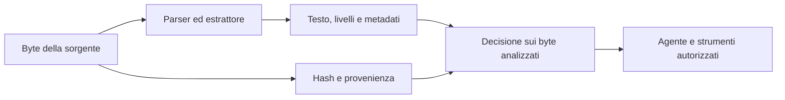

# Protezioni documentali e integrità MCP: evidenze, confini e priorità per Cheker

**Rapporto tecnico — 15 settembre 2026.** Destinatari: manutentori, integratori di agenti e responsabili tecnici che devono decidere quali documenti e strumenti ammettere in un flusso di lavoro Linux.

Il riferimento implementativo è MCP Integrity Guard 1.0.0, wheel SHA-256 `f426c5aa25e23466a6401c883c44fb6cb224335296797370b8391ec43db10d9e`, qualificata e installata il 15 settembre 2026 (ora locale). I confronti con le precedenti wheel 039e e d595 sono indicati dove rilevanti; eventuali sviluppi successivi non sono attribuiti a questa build. Le fonti esterne sono state consultate il 15 settembre 2026, ora locale europea.

La wheel f426 include il profilo XLSX statico Transitional con registro esplicito: celle, stringhe, proprietà e viste nascoste entro limiti; formule, immagini, incorporamenti, contenuti esterni fuori profilo e parti non coperte sono rifiutati. Dopo il preflight storico da 156 verifiche mirate, la wheel installata ha superato le suite complete su Python 3.13 e 3.11, l’installazione pulita, l’upgrade e una prova Windows con XLSX ordinario. I 59 casi XLSX per interprete sono già inclusi nelle suite: non vengono sommati di nuovo. [Estrattori](ESTRATTORI.md) descrive il contratto e [Validazione](VALIDAZIONE.md) attribuisce gli esiti. La matrice seguente descrive f426, non la precedente 039e priva di estrattore XLSX.

## 1. Conclusione tecnica e metodo

Cheker può verificare la continuità fra una definizione MCP approvata e quella presentata al momento dell’uso; può inoltre analizzare documenti entro un profilo dichiarato e consegnare soltanto i byte associati a un esito consentito. Queste funzioni affrontano problemi distinti. La firma di una configurazione non dimostra che le sue istruzioni siano innocue. Un documento privo di segnali conosciuti non autorizza tutte le azioni che un agente potrebbe intraprendere dopo averlo letto.

La protezione utile nasce dall’unione di quattro controlli: provenienza e versione, completezza dell’estrazione, decisione verificata sugli stessi byte, permessi dell’applicazione che consuma il risultato. Cheker implementa parti dei primi tre; il quarto richiede anche decisioni dell’integratore. Non è presente un controllo universale di ogni lettura filesystem, chiamata MCP o trasferimento di dati effettuato da programmi esterni.

Nel testo le evidenze sono distinte così:

| Classe | Significato |
|---|---|
| **Osservazione** | Attività descritta attraverso telemetria o riscontro diretto della fonte primaria |
| **Esperimento** | Dimostrazione, studio controllato o benchmark con condizioni proprie |
| **Implementazione** | Comportamento riscontrabile nel codice e nella documentazione di Cheker |
| **Inferenza** | Conseguenza progettuale proposta qui, non risultato misurato sul prodotto |
| **In corso** | Prova avviata della quale non è ancora disponibile un risultato finale |

Sono stati letti articoli, documentazione normativa e sorgenti pertinenti. Non sono stati scaricati corpora o documenti malevoli, generati nuovi payload, riprodotti exploit o eseguite nuove prove del prodotto per questa ricerca. Le percentuali degli studi rimangono attribuite agli autori e alle rispettive distribuzioni; non diventano stime dell’efficacia di Cheker.

## 2. Che cosa dimostrano realmente gli studi e i casi pubblici

### Dati esterni che diventano istruzioni

**Greshake e altri, 2023 — esperimento fondativo.** Il lavoro mostra come un’applicazione con LLM possa trattare materiale recuperato dall’esterno come istruzioni operative, con conseguenze sulla riservatezza e sull’integrità. Il §5.2 delimita esplicitamente le prove: applicazioni sintetiche e file HTML locali usati con la sidebar Bing Chat; gli autori evitarono inserimenti pubblici effettivi. Alcuni prodotti citati non erano disponibili per una verifica diretta. È quindi un’evidenza del meccanismo e di esposizioni sperimentali, non il censimento di una campagna osservata contro tutti quei prodotti.[^1]

**The Hidden Threat in Plain Text, 2025 — studio dei loader RAG.** Gli autori esaminano nove categorie e diciannove tecniche su DOCX, HTML e PDF, cinque loader e 357 scenari, riportando il 74,4% di successo nella valutazione dell’ingestione. Studiano anche sei sistemi RAG. Le prove utilizzano documenti e interrogazioni controllati; in parte impiegano un giudice LLM. La percentuale non rappresenta la prevalenza di attacchi reali, né un tasso di errore di Cheker. Il contributo pertinente è che il loader stesso può cambiare quali informazioni arrivano al modello.[^2]

**PhantomLint, 2025 — confronto fra estrazione e visibilità.** Il prototipo cerca istruzioni sospette e confronta il testo estratto con OCR della regione visuale corrispondente. Nella valutazione dichiarata di 3.402 documenti, un sottoinsieme di 3.257 articoli ICML produce tre falsi positivi, pari allo 0,092%; non è un tasso universale. I 26 casi sintetici di generalità vengono rilevati. Il lavoro riporta anche istruzioni nascoste in documenti pubblici, senza dimostrare che ogni presenza abbia causato una compromissione. OCR, rendering e distribuzione dei documenti condizionano i risultati. Cheker non implementa questa pipeline visuale.[^3]

**CrackedPDFs, 2026 — benchmark controllato.** Il lavoro costruisce 29.322 PDF da 4.983 documenti base, distinguendo iniezioni e controlli benigni abbinati. Nella valutazione bilanciata su 1.946 documenti riporta 95,9% di accuratezza di classificazione e 100% nell’ordinamento delle 973 coppie: sono metriche diverse. Gli autori segnalano scorciatoie nei classificatori e limiti sulle famiglie escluse dall’addestramento. Non dimostrano copertura di PDF arbitrari, scansioni OCR o tecniche future. Nessuna parte del benchmark è stata eseguita su Cheker per questo rapporto.[^4]

### Una vulnerabilità in produzione non equivale a una campagna osservata

**EchoLeak — scoperta sperimentale in un servizio reale.** La disclosure originale di Aim Labs descrive una catena in Microsoft 365 Copilot nella quale contenuto esterno recuperato poteva concorrere all’esfiltrazione di informazioni dal contesto. La fonte afferma che, al momento della disclosure, Aim non conosceva clienti colpiti: è un limite della sua conoscenza, non una prova assoluta di assenza di abusi.[^5] Microsoft ha successivamente descritto CVE-2025-32711 come corretta, precisando condizioni e accesso a dati già disponibili alla vittima.[^6] L’articolo nei *Proceedings of the AAAI Symposium Series* è un’analisi successiva del caso, distinta dalla scoperta originale.[^7]

**Inferenza per Cheker.** Verificare un allegato o il testo recuperato riduce una superficie d’ingresso, ma non controlla automaticamente il canale con cui l’agente potrebbe trasmettere altri dati. Il permesso di leggere una fonte e quello di inviare informazioni devono essere valutati separatamente dall’applicazione utilizzatrice.

### MCP: descrizioni e combinazioni di strumenti

**Invariant, tool poisoning — esperimento divulgato nell’aprile 2025.** Le prove mostrano che istruzioni nelle descrizioni di strumenti possono influenzare un assistente e l’impiego di altri strumenti. La fonte tratta anche modifiche successive all’approvazione e interferenze fra server. Le conclusioni riguardano le configurazioni sperimentate all’epoca, non ogni versione corrente dei client MCP. Il collegamento con Cheker è diretto: conservare la definizione completa, renderla riesaminabile e verificare le variazioni prima dell’uso affronta il problema della fiducia concessa a una descrizione che poi cambia.[^8]

**Invariant, GitHub MCP — esperimento del maggio 2025.** In repository controllati, un contenuto non fidato induce una sequenza di strumenti legittimi che attraversa il confine fra informazioni pubbliche e private. La dimostrazione è una *toxic flow*: il rischio dipende dalla combinazione e dal trasferimento dei dati, anche senza modificare il codice dei singoli strumenti. Il caso non è presentato qui come incidente criminale osservato. Un hash stabile dei tool non è una policy di flusso informativo.[^9]

### Unicode: distinguere occultamento e istruzioni

**Microsoft, settembre 2026 — osservazione di phishing.** La ricerca descrive campagne con Unicode Tags, un aumento il 9 febbraio 2026 e attività elevata per circa tre mesi. Nei campioni esaminati i caratteri servivano a eludere filtri testuali: Microsoft non trovò istruzioni nascoste dirette a sistemi AI. Il collegamento storico con la prompt injection non cambia la natura dell’attività osservata. La fonte segnala inoltre falsi positivi causati dalle tre legittime bandiere emoji con tag. È una ragione concreta per distinguere anomalia, contesto e intento.[^10]

## 3. Dal file all’azione: confini che non vanno confusi

Il percorso rilevante comprende almeno cinque trasformazioni. Un controllo efficace deve dichiarare su quale opera e che cosa resta fuori.

**Implementazione.** L’estrattore di Cheker separa segmenti visibili, nascosti e metadati; lo scanner applica indicatori e normalizzazioni limitate. Il servizio verifica il report restituito dal worker, inclusi dimensione, hash, completezza e coerenza. Il lettore protetto vincola la consegna allo snapshot letto, invece di usare una scansione storica come autorizzazione permanente.[^23]

**Inferenza.** Le informazioni scartate prima della classificazione non possono essere recuperate da una regola applicata soltanto al testo rimanente. Serve perciò una nozione esplicita di “documento interamente gestibile dal profilo”, oltre alla nozione di “nessun indicatore trovato”. La completezza deve riferirsi alle parti effettivamente considerate e ai rifiuti dichiarati; non alla sola assenza di eccezioni del parser.

OWASP colloca la prompt injection fra i rischi applicativi e raccomanda separazione del materiale non fidato, privilegio minimo e controlli sulle azioni e sugli output. Queste indicazioni non sono una certificazione, né rendono il RAG una barriera sufficiente.[^11] La guida OWASP agli upload distingue estensione, contenuto, dimensioni, autorizzazione e isolamento: controllare soltanto MIME o nome del file non basta. Antivirus, sandbox e ricostruzione dei contenuti sono livelli possibili, con finalità diverse.[^12]

Per l’integratore ne discende una regola operativa: un risultato `ALLOWED` vale per il contenuto e il contesto verificati. L’agente deve ancora disporre soltanto degli accessi necessari al lavoro richiesto. L’approvazione di un documento non autorizza nuove destinazioni di rete, letture di archivi estranei o pubblicazioni automatiche.

## 4. Matrice dei formati prioritari

La colonna di stato descrive il profilo della wheel f426, inclusi XLSX statico e i controlli DOCX e Unicode Tags ereditati dalla 039e. “Supportato” non significa che ogni documento formalmente valido venga accettato.

| Formato | Superfici da considerare | Profilo e limite effettivo |
|---|---|---|
| **PDF** | Testo, ordine di estrazione, metadati, annotazioni, moduli, immagini e contenuti attivi | Supporto ristretto; niente OCR. Immagini, cifratura e contenuti non gestibili possono determinare analisi incompleta e blocco |
| **DOC** | Contenitore binario composto, flussi e strutture Word | **Non supportato**; non viene reinterpretato come testo o DOCX |
| **DOCX** | Parti ZIP, XML, stili, note, commenti, metadati, import e relazioni | Supporto ristretto, senza immagini/oggetti incorporati. Rifiuto esplicito delle parti non ispezionate, degli import alternativi e dei contenuti esterni non supportati |
| **XLS** | Struttura binaria, record e sottoflussi del workbook | **Non supportato**; nessuna esecuzione o valutazione delle formule |
| **XLSX** | Fogli separati, stringhe condivise, formule, stati nascosti e relazioni | Profilo statico Transitional; celle, stringhe, proprietà e viste nascoste. Formule, media, macro, parti non ispezionate e strutture fuori profilo restano bloccati |
| **TXT** | Istruzioni in prosa, caratteri invisibili, direzionalità e codifiche | Supportato con decodifica rigorosa e analisi testuale; nessuna comprensione universale dell’intento |
| **MD** | Testo, link, codice, HTML incorporato e frontmatter | Supportato come testo e metadati iniziali; non esegue codice, non visita link e non riproduce un renderer Markdown |

### PDF: il testo estratto non attesta la pagina

La documentazione pypdf distingue estrazione testuale e OCR: il testo può essere posizionato o ordinato in modi non coincidenti con la lettura umana; un livello testuale associato a un’immagine può essere inesatto. Il parser non diventa un OCR per il fatto di restituire caratteri.[^13]

**Implementazione.** Cheker usa parsing PDF rigoroso, limita il numero di pagine e ispeziona anche metadati, annotazioni e alcuni campi dei moduli. Cerca indicatori di testo nascosto nelle istruzioni grafiche gestite. Respinge condizioni quali cifratura, contenuti attivi o incorporati individuati e immagini che richiedono una pipeline OCR non disponibile. Una pagina priva di testo estraibile non viene dichiarata validata sulla sola base del parsing riuscito.[^23]

**Limite.** Non esistono rendering completo, ricostruzione visuale equivalente al lettore umano o confronto OCR. Il rilevamento di colore chiaro, testo minuscolo o modalità testuali particolari è un insieme di indicatori, non una prova geometrica generale. Un PDF ordinario contenente immagini può essere respinto anche se innocuo: questa perdita di compatibilità deve essere visibile all’operatore.

### DOC, XLS e XLSX: l’estensione non è una scorciatoia

Le specifiche Microsoft descrivono DOC attraverso un contenitore Compound File con flussi e storages; XLS impiega flussi di record e sottoflussi per elementi del workbook. Non sono formati UTF-8 equivalenti a TXT o CSV.[^14][^15] SpreadsheetML distribuisce informazioni fra parti, fogli, stringhe condivise e altri elementi; la specifica SDK distingue stati del foglio visibile, nascosto e molto nascosto.[^16][^17]

**Implementazione f426.** Il registro include soltanto l’estrattore XLSX statico confezionato nel codice fidato. Il profilo dichiara parti, livelli, budget e rifiuti; analizza anche viste nascoste e metadati, senza calcolare formule o accettarne soltanto il valore memorizzato. DOC e XLS binari, XLSM e XLSB restano non supportati. Non esiste installazione di plugin da documenti o percorsi dell’utente.[^23]

**Inferenza.** Ogni estensione futura deve mantenere espliciti i propri criteri di completezza. Estrarre soltanto celle visibili o rinominare il suffisso produrrebbe un contratto ambiguo; la copertura del sottoinsieme statico non attesta equivalenza con Excel.

### TXT e Markdown: semplicità del contenitore, non dell’intento

**Implementazione.** Il testo viene decodificato secondo il profilo ammesso; errori di codifica e contenuti incompatibili impediscono un esito completo. Il frontmatter Markdown YAML/TOML viene considerato testo di metadati, con limiti propri, senza essere deserializzato come istruzione applicativa. Codice e script restano dati. I link non vengono aperti.[^23]

**Inferenza.** Anche una frase perfettamente visibile può chiedere al modello di ignorare il compito o divulgare informazioni. La presenza di parole imperative in un manuale legittimo può invece causare un falso positivo. Separare testo citato, istruzioni dell’utente e autorizzazioni degli strumenti rimane responsabilità dell’applicazione che costruisce il contesto dell’agente.

## 5. Integrità MCP: ciò che hash, firme e gate attestano

La canonicalizzazione di Cheker serve a confrontare strutture senza perdere la possibilità di rilevare una modifica dei byte originali. JSON, JSON5, YAML, TOML e `.env` hanno adattatori con controlli di ambiguità, duplicati e limiti. Il profilo è specifico del prodotto; non dichiara conformità a RFC 8785/JCS.[^23]

| Evidenza | Che cosa rappresenta | Che cosa non dimostra |
|---|---|---|
| `raw_hash` | SHA-256 dell’intera sorgente letta | Innocuità del contenuto o autore originale |
| `canonical_hash` | Definizione normalizzata con contesto pertinente | Equivalenza di ogni interpretazione possibile |
| `semantic_fingerprint` | Impronta strutturale con separazione di dominio | Comprensione semantica o intenzione benevola |
| Firma Ed25519 | Approvazione registrata su identità, versione, hash e policy | Affidabilità di un host amministrativo compromesso |
| Audit e checkpoint | Collegamenti e firme delle evidenze persistite | Rilevazione autonoma di ogni rollback coordinato dello stato |

**Implementazione.** Le identità dei componenti restano riconoscibili attraverso cambiamenti del contenuto. I metadati globali e di connessione vengono inclusi nelle definizioni figlie: cambiare il server può quindi invalidare l’approvazione dei suoi strumenti. I valori sensibili partecipano agli hash, anche quando la presentazione li maschera. Il confronto distingue formato, semantica strutturale e sicurezza; anche una variazione del solo formato richiede una nuova versione approvata. Ritornare ai vecchi byte non ripristina automaticamente una fiducia revocata o superata.[^23]

Prima dell’approvazione e dell’uso, il gate rilegge la sorgente e controlla versione, firma, policy ed evidenze correnti. Una sorgente mancante, uno snapshot non valido o una richiesta obsoleta non producono consenso. La proiezione dell’inventario può verificare lo snapshot persistito senza rileggere ogni sorgente durante il polling; `snapshot_valid` non sostituisce il gate.

**Confine.** La discovery non esegue il comando configurato e non interroga automaticamente il comportamento del server remoto. L’integratore deve portare nel controllo la definizione effettivamente utilizzata. L’approvazione del testo di una descrizione non attesta l’eseguibile, l’immagine container o ogni risposta futura del servizio. Due strumenti approvati possono ancora essere combinati in un flusso non autorizzato: serve una policy applicativa sugli accessi e sulle destinazioni.

La chiave privata, il database e il servizio amministrativo appartengono alla base di fiducia locale. Il nome dell’approvatore non equivale a un’identità aziendale autenticata da un sistema esterno. Per esigenze più forti occorrono controlli organizzativi e riferimenti di audit conservati fuori dall’host; non vanno attribuiti retroattivamente alla firma locale.

## 6. Unicode Tags: conservare la prova, normalizzare l’analisi

Unicode UTS #51 versione 17.0, revisione 29, distingue le sequenze emoji ammesse e quelle raccomandate per lo scambio generale, dette RGI. L’elenco ufficiale `emoji-sequences.txt` identifica tre sequenze RGI con tag per Inghilterra, Scozia e Galles. La lista è versionata: una sequenza sintatticamente componibile non diventa automaticamente un’emoji RGI.[^18][^19]

**Modifica qualificata dalla build 039e e conservata nella f426.** Il codice estende il segnale di caratteri invisibili all’intervallo Unicode Tags, preservando l’eccezione delle tre sequenze complete RGI. L’eccezione riguarda il segnale di anomalia: non autorizza il documento, non disattiva le altre regole e non estende fiducia ai caratteri adiacenti. Le 21 prove funzionali Unicode della suite installata sono passate su Python 3.13 e 3.11. La modifica non appartiene al precedente wheel d595.

**Inferenza progettuale.** È opportuno mantenere due rappresentazioni: gli originali, ai quali si riferisce l’hash RAW, e le varianti limitate usate nell’analisi. Rimuovere caratteri invisibili soltanto dalla seconda può aiutare il confronto; riscrivere l’originale cancellerebbe parte dell’evidenza. Anche l’interfaccia dovrebbe mostrare gli indicatori mediante escape leggibili, evitando che la rappresentazione del finding nasconda nuovamente il problema.

La classificazione deve restare proporzionata: una bandiera legittima non prova un attacco; un tag anomalo non prova da solo una specifica istruzione; l’assenza di tag non esclude istruzioni ostili visibili. Le regressioni funzionali pertinenti riguardano caratteri ordinari, le tre sequenze consentite, preservazione dei byte e classificazione distinta. Questo rapporto non aggiunge generatori o nuove famiglie di payload.

## 7. DOCX: parti importate, relazioni e completezza

`altChunk` è un punto del documento che richiede l’importazione di altro contenuto. La descrizione OpenXML prevede una relazione verso una parte interna; il termine “external content” nel nome dell’elemento non significa necessariamente una richiesta di rete. Microsoft consente a un consumatore che non gestisce l’importazione di ometterla e continuare: è una scelta di visualizzazione, non una garanzia di scansione completa.[^20]

La documentazione MS-OE376 descrive le grafie di relazione `aFChunk` e `afChunk` e formati importabili che comprendono HTML e testo semplice. Non tutte le parti di un contenitore DOCX sono quindi necessariamente XML.[^21] Separatamente, `TargetMode` distingue relazioni interne ed esterne; una destinazione esterna può avere URI relativo oppure assoluto. La ricerca del solo prefisso HTTP non rappresenta tale distinzione.[^22]

**Riscontro sulla baseline documentata.** L’estrattore controlla limiti ZIP, nomi, compressione, XML sicuro, media e incorporamenti; nel percorso precedente esaminava `.xml` e `.rels`, saltando altre parti non già respinte. La proposta funzionale individua questa differenza fra parti presenti e parti effettivamente analizzate. È un riscontro sul percorso del codice, non l’esito di un nuovo exploit riprodotto.[^24]

**Modifica qualificata dalla build 039e e conservata nella f426.** Il codice introduce un rifiuto esplicito per parti non ispezionate, import `altChunk` e relazioni esterne non comprese nel profilo. Gli hyperlink ordinari rimangono metadati senza visita della destinazione. Le vere directory ZIP vuote non sono considerate contenuto. La distinzione fra formato malformato e funzionalità non gestita deve restare visibile nel report.

| Condizione | Decisione prevista dalla proposta | Stato di questo rapporto |
|---|---|---|
| Parti contenenti dati fuori dal profilo XML/relazioni | Analisi incompleta; niente accettazione per semplice omissione | Presente dalla 039e; verificato anche nella f426 |
| Anchor o relazione di importazione alternativa | Rifiuto finché l’importazione non è implementata | Presente dalla 039e; verificato anche nella f426 |
| Risorsa esterna non supportata, anche con URI relativo | Rifiuto senza recuperare la risorsa | Presente dalla 039e; verificato anche nella f426 |
| Normale hyperlink | Ispezione del metadato, senza attestare la destinazione | Presente dalla 039e; verificato anche nella f426 |

**Compatibilità.** Il profilo può rifiutare DOCX innocui con anteprime, font o parti aggiuntive non gestite. Un documento formalmente valido per Office non è necessariamente interamente analizzabile da Cheker. Questa restrizione non introduce OCR, valutazione dei campi dinamici, validazione completa OPC o equivalenza visuale. I 30 casi DOCX delle suite installate passano su entrambi gli interpreti della f426; la restrizione resta quella dichiarata, senza estensione a documenti arbitrari.

## 8. Isolamento, decisioni e copie HTML

**Implementazione.** Lo scanner lavora in un processo Python isolato, con ambiente ridotto e input su pipe. Su Linux, Landlock e seccomp vengono applicati prima della lettura del documento. Il profilo richiede Landlock ABI almeno 3 e libseccomp con API almeno 3; l’assenza del confinamento necessario interrompe il percorso consentito. Runtime, librerie e codice confezionato fanno parte della base fidata.[^23]

| Risorsa | Limite del servizio documentale |
|---|---|
| File di ingresso | 10 MiB |
| Estrazione | Fino a 8.000.000 caratteri e 20.000 segmenti, con budget anche proporzionale all’input |
| Worker scanner | 512 MiB di spazio indirizzi; 10 secondi CPU; timeout del parent 12 secondi |
| Protocollo scanner | 4 MiB per l’output raccolto |
| PDF | 100 pagine; niente OCR |
| DOCX | 2.048 membri; 8.000.000 byte per membro; 24.000.000 espansi complessivi; rapporto massimo 100 |
| XLSX statico | 100 fogli; 20.000 celle materialmente presenti e 20.000 stringhe condivise; budget ZIP/XML e di estrazione comuni |
| Concorrenza | Due slot condivisi fra scansioni e stadi delle copie HTML |

I limiti sono parte del contratto, non soglie al di sotto delle quali qualsiasi file diventa sicuro. Il confinamento limita ciò che il processo estrattore può fare al sistema; non impedisce a un modello esterno di interpretare erroneamente il testo che riceve. Anche una sandbox correttamente attiva non sostituisce il controllo delle azioni dell’agente.

La decisione ha campi distinti. `VALID` indica analisi completa senza problemi rilevati dai controlli applicati; `INFECTED` indica segnali di istruzioni o manipolazioni sospette e non una diagnosi antivirus. `CORRUPTED` e `UNSCANNABLE` distinguono malformazione e impossibilità di completare il profilo. `ALLOWED`, `FLAGGED`, `QUARANTINED` e `BLOCKED` descrivono separatamente lo stato operativo. Un formato non supportato non deve essere contato come malware rilevato.[^23]

Il lettore MCP ammette soltanto percorsi sotto radici esplicite, applica esclusioni per dati applicativi e collegamenti e consegna testo entro il proprio limite di 256 KiB dopo i riscontri richiesti. PDF, DOCX e XLSX sono disponibili per scansione, non per consegna testuale da quel lettore. Il monitor cartelle è un servizio laterale: registra e riconcilia, ma non intercetta ogni lettura esterna.

La copia `html-text-v1` è una funzione diversa dall’analisi ordinaria. Su richiesta esplicita esegue una scansione completa dell’originale, una trasformazione confinata e una nuova scansione degli esatti byte UTF-8 prodotti. Il limite della copia è 256 KiB. Solo il POST corrente può consegnarla dopo esito completo `VALID`/`ALLOWED`, assenza di finding, riscontro di hash, dimensione e policy e registrazione riuscita; i GET espongono metadati e riferimenti ai due report.[^23]

`SANITIZED` descrive la trasformazione, non una nuova autorizzazione. Markup, attributi e metadati possono andare persi; CSS e strutture fuori dal sottoinsieme vengono rifiutati. L’originale resta invariato. Non sono implementati bonifica generale, rendering, OCR o equivalenza semantica. Un testo sospetto conservato nella copia deve ancora superare la seconda analisi.

## 9. Priorità difensive e criteri di accettazione

Le priorità seguenti derivano dai confini descritti; non costituiscono risultati sperimentali o impegni di funzionalità già rilasciate.

1. **Chiudere la completezza dichiarata.** Le estensioni dei profili DOCX e XLSX devono distinguere parti analizzate, parti escluse con motivazione e documento malformato. Un caso fuori profilo deve restare bloccato anche se il suo testo ordinario è innocuo. Prima del rilascio servono evidenze del worker installato, non soltanto della funzione chiamata nel processo dei test.
2. **Preservare l’identità attraverso le trasformazioni.** Originale, rappresentazioni d’analisi e copia consegnata devono avere ruoli separati. Ogni consegna deve identificare hash e report dei byte effettivi. Un cambiamento delle regole, dell’estrattore o della policy deve invalidare il riuso non coerente dei risultati.
3. **Rendere visibile l’incompletezza operativa.** Il monitor deve esporre copertura parziale, errori e prosecuzione delle passate. Il registro deve distinguere elaborazioni, hash unici, rifiuti per limite e segnali sospetti. L’interfaccia non deve trasformare uno snapshot non verificabile in un’approvazione apparente.
4. **Integrare privilegi e destinazioni.** Chi adotta Cheker deve vincolare gli strumenti dell’agente ai dati e alle azioni necessari. L’uso di tool approvati non deve conferire implicitamente facoltà di pubblicare o trasferire qualsiasi informazione letta.
5. **Estendere i formati soltanto con un contratto verificabile.** OCR, DOC, XLS e ulteriori parti del formato XLSX richiedono parser, dipendenze e criteri di completezza propri. La loro priorità dipende dai documenti realmente necessari, non dall’aggiunta di suffissi a una lista.

Per misurare utilità operativa sono necessari denominatori espliciti. Registrare la quota di documenti del campione che appartiene al profilo, i rifiuti per OCR o parti non gestite, la latenza per formato e dimensione, i timeout e il tempo necessario all’operatore per decidere sui finding. Per i falsi positivi utilizzare documenti benigni etichettati con criteri dichiarati; per qualunque stima di falsi negativi serve un insieme di riferimento autorizzato e definito. Nessuna percentuale è ricavabile dal solo conteggio dei report `VALID`.

La suite e le prove già autorizzate restano l’evidenza disponibile: conservare versioni, hash, condizioni, fallimenti iniziali e risultati finali separati. Un collaudo prolungato senza errori di processo misura affidabilità nelle operazioni esercitate; non misura da solo la copertura di istruzioni sconosciute.

## 10. Condizioni per una descrizione pubblica corretta

Una descrizione sostenibile è: **Cheker verifica versioni approvate di definizioni MCP, analizza un insieme dichiarato di documenti in worker Linux confinati e offre percorsi di lettura che richiedono risultati coerenti con gli stessi byte.** Occorre accompagnarla con i formati e i limiti effettivi, il ruolo del chiamante e l’assenza di una garanzia universale.

Non sono sostenute dalle evidenze espressioni come “rileva ogni prompt injection”, “qualsiasi PDF/DOCX è sicuro dopo la scansione”, “una firma impedisce le toxic flow” o “SANITIZED conserva il significato originale”. Ogni estensione successiva richiede una nuova attribuzione a sorgente, wheel, installazione e risultati pertinenti. Nella f426 entrambe le suite installate Python 3.13 e 3.11 hanno concluso 1.146 prove positive e una esclusione specifica Windows, comprese 59 prove XLSX, 21 Unicode Tags e 30 DOCX. La prova di upgrade ha superato 48 controlli. La prova di durata XLSX della f426 ha concluso con esito **PASS** su una sola fixture ordinaria, con raccolta terminale verificata; resta distinta dalle prove sulle wheel precedenti. Il risultato non attesta assenza di perdite di memoria né copertura di altri documenti: misure, ruolo del controller e limiti della raccolta sono riportati nel registro di validazione. Questi conteggi non misurano una copertura universale degli attacchi. I dettagli e i limiti del collaudo sono in [Validazione](VALIDAZIONE.md).

Per esercizio e manutenzione rimangono autorevoli i documenti del repository: `docs/MANUALE_TECNICO.md`, `docs/LINUX_SANDBOX.md`, `docs/MCP_INTEGRATION.md`, `docs/SANITIZZAZIONE.md`, `docs/ESTRATTORI.md`, `docs/SVILUPPO.md` e `docs/VALIDAZIONE.md`. Backup e ripristino devono preservare chiavi, checkpoint e stato, non soltanto esportazioni parziali. In particolare, l’API di export audit restituisce al massimo gli ultimi **100.000 eventi** e non equivale al backup completo.

## Note e inventario delle fonti

Le note identificano fonti primarie: ricerca originale, disclosure dei ricercatori, documentazione del fornitore, standard o linee guida ufficiali. Le date indicano pubblicazione/versione quando verificabile; “senza data esposta” non significa documento recente. Non sono state usate metriche di fornitori come confronto prestazionale di Cheker.

[^1]: Kai Greshake e altri, *Not what you've signed up for: Compromising Real-World LLM-Integrated Applications with Indirect Prompt Injection*, [arXiv 2302.12173, v2](https://arxiv.org/html/2302.12173v2), 5 maggio 2023; prima versione 23 febbraio 2023. Ricerca originale; particolarmente pertinente §5.2 sui limiti delle prove.

[^2]: Alberto Castagnaro e altri, *The Hidden Threat in Plain Text: Attacking RAG Data Loaders*, [arXiv 2507.05093, v1](https://arxiv.org/html/2507.05093v1), 7 luglio 2025. Preprint originale; la scheda consultata lo descrive come sottoposto a valutazione. Rilevanti metodologia e valutazione end-to-end.

[^3]: Toby Murray, *PhantomLint: Principled Detection of Hidden LLM Prompts in Structured Documents*, [arXiv 2508.17884, v2](https://arxiv.org/html/2508.17884v2), 23 ottobre 2025; prima versione 25 agosto 2025. Ricerca originale; risultati e limiti dipendono dalla pipeline visuale.

[^4]: Pukaphol Thienpreecha e Karthik Subramanian, *CrackedPDFs: A Controlled Benchmark for Hidden Prompt Injection in PDFs*, [arXiv 2607.19396, v2](https://arxiv.org/html/2607.19396v2), 2 agosto 2026; scheda originale: 3 luglio 2026. Ricerca originale; rilevanti metriche sulle coppie e limiti di generalizzazione.

[^5]: Itay Ravia, Aim Labs, [*Breaking down ‘EchoLeak’*](https://www.catonetworks.com/blog/breaking-down-echoleak/), disclosure originale ora ospitata da Cato Networks. La pagina migrata espone 31 maggio 2025; non si ricostruisce qui la cronologia della migrazione. Fonte della scoperta e della dichiarazione limitata sull’assenza di clienti noti colpiti.

[^6]: Microsoft Detection and Response Team, [*AI Application Security Series 1: Security considerations when adopting AI tools*](https://www.microsoft.com/en-us/security/security-insider/emerging-trends/ai-application-security-considerations-for-organizations), 17 dicembre 2025. Conferma ufficiale leggibile della correzione EchoLeak. Il record [MSRC CVE-2025-32711](https://msrc.microsoft.com/update-guide/vulnerability/CVE-2025-32711) è identificato ma richiede JavaScript nel browser usato: non è assunto come testo verificato per ulteriori dettagli.

[^7]: Pavan Reddy e Aditya Sanjay Gujral, [*EchoLeak: The First Real-World Zero-Click Prompt Injection Exploit in a Production LLM System*](https://ojs.aaai.org/index.php/AAAI-SS/article/view/36899), *Proceedings of the AAAI Symposium Series* 7(1), pp. 303–311, 23 novembre 2025, DOI 10.1609/aaaiss.v7i1.36899. Analisi accademica successiva; non disclosure originale né articolo della conferenza principale AAAI.

[^8]: Luca Beurer-Kellner e Marc Fischer, Invariant Labs, [*MCP Security Notification: Tool Poisoning Attacks*](https://invariantlabs.ai/blog/mcp-security-notification-tool-poisoning-attacks), 1 aprile 2025, con aggiornamenti di aprile. Ricerca sperimentale originale dei divulgatori.

[^9]: Invariant Labs, [*GitHub MCP Exploited: Accessing private repositories via MCP*](https://invariantlabs.ai/blog/mcp-github-vulnerability), 26 maggio 2025. Dimostrazione originale di flusso informativo attraverso strumenti legittimi.

[^10]: Noam Kochavi e Sarah Wolstencroft, Microsoft Security Research, [*ASCII smuggling crosses over from AI prompt injection to phishing evasion*](https://www.microsoft.com/en-us/security/blog/2026/09/03/ascii-smuggling-crosses-over-from-ai-prompt-injection-to-phishing-evasion/), 3 settembre 2026. Telemetria e analisi della campagna osservata.

[^11]: OWASP GenAI Security Project, [*LLM01:2025 Prompt Injection*](https://genai.owasp.org/llmrisk/llm01-prompt-injection/), edizione 2025. Linea guida ufficiale; pagina consultata senza data puntuale di revisione esposta.

[^12]: OWASP Cheat Sheet Series, [*File Upload Cheat Sheet*](https://cheatsheetseries.owasp.org/cheatsheets/File_Upload_Cheat_Sheet.html), pagina corrente senza data di revisione esposta. Linea guida ufficiale per applicazioni che ricevono file.

[^13]: Progetto pypdf, [*Extract Text from a PDF*](https://pypdf.readthedocs.io/en/stable/user/extract-text.html), documentazione ufficiale corrente, intestazione 6.18.1 durante la consultazione. Questo numero identifica la documentazione letta, non la dipendenza installata in Cheker.

[^14]: Microsoft Open Specifications, [*MS-DOC, §2.1 File Structure*](https://learn.microsoft.com/en-us/openspecs/office_file_formats/ms-doc/4eaddc8f-4abd-43bb-8fd4-aef9c6121737), 14 febbraio 2019. Specifica del contenitore DOC binario.

[^15]: Microsoft Open Specifications, [*MS-XLS, §2.1.2 Stream*](https://learn.microsoft.com/en-us/openspecs/office_file_formats/ms-xls/f67ac5ed-b0a7-4b2c-9b7a-28933eeaac7e), 14 febbraio 2019. Specifica dei flussi XLS.

[^16]: Microsoft Learn, [*Structure of a SpreadsheetML document*](https://learn.microsoft.com/en-us/office/open-xml/spreadsheet/structure-of-a-spreadsheetml-document), documentazione ufficiale corrente; data non esposta nel testo consultato.

[^17]: Microsoft Learn, [*SheetStateValues Enum*](https://learn.microsoft.com/en-us/dotnet/api/documentformat.openxml.spreadsheet.sheetstatevalues?view=openxml-3.0.1), documentazione Open XML SDK, vista 3.0.1; data non esposta. Fonte degli stati di visibilità.

[^18]: Mark Davis e Ned Holbrook, Unicode Consortium, [*UTS #51 Unicode Emoji, revisione 29*](https://www.unicode.org/reports/tr51/tr51-29.html), Unicode 17.0, 4 settembre 2025. Standard ufficiale versionato.

[^19]: Unicode Consortium, [*emoji-sequences.txt, Unicode 17.0.0*](https://www.unicode.org/Public/17.0.0/emoji/emoji-sequences.txt), dati ufficiali della versione 17.0. Le tre voci `RGI_Emoji_Tag_Sequence` sono state consultate; nessun corpus di attacco è stato acquisito.

[^20]: Microsoft Learn, [*AltChunk Class*](https://learn.microsoft.com/en-us/dotnet/api/documentformat.openxml.wordprocessing.altchunk?view=openxml-3.0.1), Open XML SDK, vista 3.0.1, note normative ISO/IEC 29500-1. Pagina senza data esposta; letti i vincoli di importazione e destinazione interna.

[^21]: Microsoft Open Specifications, [*MS-OE376, §2.1.558, Part 4 §2.17.3.1 altChunk*](https://learn.microsoft.com/en-us/openspecs/office_standards/ms-oe376/4822a0c9-64d9-4099-bf2b-80b1514c7674), 16 agosto 2022. Specifica delle particolarità di implementazione Word.

[^22]: Microsoft Learn, [*PackageRelationship.TargetMode Property*](https://learn.microsoft.com/en-us/dotnet/api/system.io.packaging.packagerelationship.targetmode?view=windowsdesktop-9.0), documentazione ufficiale corrente; data non esposta. Distinzione tra destinazioni interne ed esterne, anche relative.

[^23]: Evidenza interna: repository Cheker, `backend/integrity_guard/canonical.py`, `core.py`, `extraction.py`, `scanner.py`, `scan_protocol.py`, `scan_worker.py`, `linux_sandbox.py`, `reports.py`, `mcp_server.py`, `filewatch.py`, `sanitizer.py`, `extractor_registry.py`, `trusted_extractors.py` e `xlsx_extractor.py`; manuali specialistici elencati nel §10. Lettura documentale e del codice, senza nuove esecuzioni. Per hash degli artefatti distribuiti ed esiti di prova consultare `docs/VALIDAZIONE.md` e i manifest della release citata.

[^24]: Nota interna di progettazione, *Proposta DOCX: rifiuto delle parti non ispezionate*, 15 settembre 2026, conservata nelle evidenze `research-protections-20260914/docx-proposal.md`. La nota registra sorgenti e hash esaminati, la lacuna funzionale e il contratto proposto. L’implementazione successiva resta distinta dai risultati della baseline.
